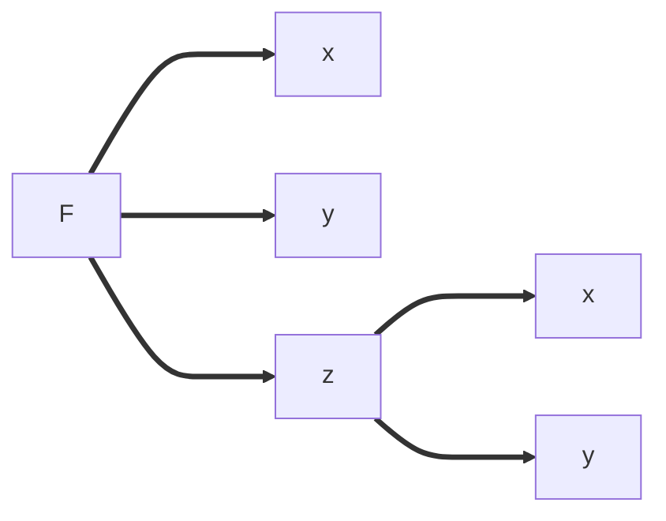

[toc]

# 1. 多元函数的基本概念

|基本概念|描述|
|-|-|
|坐标平面|二元有序实数组 $(x,y)$ 的全体，即：$\bold{R}^2 = \bold{R} \times \bold{R} = \{ x,y \mid x,y \in \bf{R} \}$ 就表示坐标平面|
|平面点集|坐标平面上具有某种性质 $P$ 的点的集合，称为平面点集，记作：$E=\{ (x,y) \mid (x,y) \text{具有性质} P\}$|
|领域|设 $P_0(x_0,y_0)$ 是 $xOy$ 平面上的一个点，$\delta$ 是某一正数。与点 $P_0(x_0,y_0)$ 距离小于 $\delta$ 的点 $P(x,y)$ 的全体，称为点 $P_0$ 的 $\delta$ 领域，记作 $U(P_0,\delta)$，即：$U(P_0, \delta)=\{ P \mid \begin{vmatrix} PP_0 \end{vmatrix} < \delta \}$ 也就是 $$U(P_0,\delta)=\{(x_0,y_0) \mid \sqrt{ (x-x_0)^2 + (y-y_0)^2 }< \delta\}$$|
|去心邻域|点 $P_0$ 的去心 $\delta$ 邻域，记作 $\mathring{U}(P_0,\delta)$，即：$\mathring{U}(P_0,\delta) = \{P \mid 0 < \begin{vmatrix} PP_0 \end{vmatrix} <\delta\}$ 如果不需要强调领域的半径 $\delta$ ，则用 $U(P_0)$ 表示点 $P_0$ 的领域，点 $P_0$ 的去心邻域记作 $\mathring{U}(P_0)$|
|内点、外点、边界点|**内点**：如果存在点 $P$ 的某邻域 $U(P)$，使得 $U(P)\subset E$，则称 $P$ 为 $E$ 的**内点**   **外点**：如果存在点 $P$ 的某邻域 $U(P)$，使得 $U(P)\cap E=\varnothing$，则称 $P$ 为 $E$ 的 外点    **边界点**：如果点 $P$ 的任意邻域既包含属于 $E$ 的点，又包含不属于 $E$ 的点，则称 $P$ 为 $E$ 的**边界点**    ① $E$ 的边界点的全体，称为 $E$ 的边界，记作：$\partial E$   ② $E$ 的内点必属于 $E$，$E$ 的外点必不属于 $E$，而 $E$ 的边界点可能属于 $E$，也可能不属于 $E$。|
|聚点|**一. 定义**   $\quad$ 如果对于任意给定的 $\delta＞0$，点 $P$ 的**去心邻域** $\mathring{U}(P_0,\delta)$ 内总有 $E$ 中的点，那么称 $P$ 是 $E$ 的**聚点**  **二. 注意**  $\quad$ 由聚点的定义可知，点集 $E$ 的聚点 $P$ 本身，可以属于 $E$，也可以不属于 $E$   **三. 意义**：  $\quad$ 定义聚点是为了保证，从 $P_0(x_0,y_0)$ 的某去心邻域内的某一点 $P(x,y)$ 出发，至少能找到一串完全在 $E$ 中的点来靠近 $P_0$；也就是说，聚点保证了下面这个极限过程是可行的、是存在的：$P\to P_0$ 或 $(x,y)\to(x_0,y_0)$   **四. 实例**   $\quad$ 平面点集：$E = \{ (x,y) \mid 1 < x^2+y^2 \leq 2 \}$   $\qquad$ ① $1 < x^2+y^2 < 2$ 均是内点；  $\qquad$ ② $x^2+y^2=1$ 是 $E$ 的边界点，但是不属于 $E$   $\qquad$ ③ $x^2+y^2=2$ 是 $E$ 的边界点，同时也属于 $E$   $\qquad$ ④ 点集 $E$ 以及它的边界 $\partial E$ 上的一切点都是 $E$ 的聚点|
|开集、闭集、连通集|① 如果点集 $E$ 的点都是内点，那么称 $E$ 为开集   ② 如果点集 $E$ 的边界点都属于 $E$，则称 $E$ 为闭集   ③ 如果点集 $E$ 内任意两点都可用折线链接起来，且该折线上的点都属于 $E$，则称 $E$ 为连通集|
|区域（开区域）、闭区域|① 连通的开集称为开区域或者区域   ② 开区域连同它的边界一起构成的点集称为闭区域|
|有界集、无界集|对于平面点集 $E$，如果存在某一常数 $r$，使得：$E\subset U(O,r)$；其中 $O$ 是原点，那么称 $E$ 为有界集，否则称为无界集|
|多元函数|① 设 $D$ 是平面上的一个点集，如果对每个点 $P(x,y) \in D$，变量 $z$ 按照某一对应规则 $f$ 总有确定的值与之对应，则称 $z$ 是自变量 $x,y$ 的**二元函数**，记作 $z = f(x,y)$。点集 $D$ 称为该函数的定义域，$x,y$ 称为自变量，$z$ 称为因变量。  ② 类似地，可以定义**三元函数** $u=f(x,y,z)$ 和 **$n$ 元函数** $u = f(x_1,x_2,\cdots,x_n)$|
|二元函数的几何意义|二元函数 $z = f(x,y)$ 图形为空间直角坐标系中的一块曲面，它在 $xOy$ 平面上的投影区域是其定义域 $D$|

# 2. 二元函数的极限与连续

|概念|描述|
|-|-|
|二重极限|设二元函数 $f(x,y)$ 的定义域为 $D$，$P_0(x_0,y_0)$ 是 $D$ 的**聚点**。如果存在常数 $A$，对于任意给定的正数 $\epsilon$，总存在正数 $\delta$，使得当点 $P(x,y)\in D\cap \mathring{U}(P_0,\delta)$ 时，都有 $\begin{vmatrix}f(x,y)-A\end{vmatrix}< \epsilon$ 成立，那么就称常数 $A$ 为函数 $f(x,y)$ 当 $(x,y)\to(x_0,y_0)$ 时的极限，记作：$$\begin{aligned}\lim_{(x,y)\to(x_0,y_0)}f(x,y)=A \quad \text{或} \quad f(x,y)\to A\ \big(\ (x,y)\to(x_0,y_0)\ \big)\end{aligned}$$|
|极限存在的判定|**一. 判定条件**   $\quad$ 从各个方向趋近 $(x_0,y_0)$ 极限都是 $A$  **二. 极限不存在**：  $\quad$ 函数 $f(x,y) =\begin{cases}  \frac{xy}{x^2+y^2},&x^2+y^2\neq 0\\ 0,&x^2+y^2=0  \end{cases}$   $\qquad $ ① 当点 $P(x,y)$ 沿 $x$ 趋近于点 $(0,0)$ 时：$\begin{aligned}I=\lim_{x \to 0}f(x,0)=0\end{aligned}$   $\qquad$ ② 当点 $P(x,y)$ 沿 $y$ 趋近于点 $(0,0)$ 时：$\begin{aligned}I=\lim_{y \to 0}f(0,y)=0\end{aligned}$   $\qquad$ ③ 当点 $P(x,y)$ 沿 $y=kx$ 趋近于点 $(0,0)$ 时：$\begin{aligned}\lim_{(x,y) \to (0,0)}\frac{xy}{x^2+y^2}=\frac{kx^2}{x^2+k^2x^2}=\frac{k}{1+k^2}\end{aligned}$   $\qquad$ ④ 故极限不存在 **三. 求极限**   $\qquad$ ① 换元转化为一元函数极限   $\qquad$ ② 极限为零，使用夹逼准则【加绝对值+放缩法+夹逼准则】|
|极限运算性质|一. 设 $\lim f(x,y) = A,\lim g(x,y) = B$，则：$\begin{cases}\lim[f(x,y) \pm g(x,y)]=A\pm B\\\lim[f(x,y) \cdot g(x,y)]=AB\\\lim{\frac{f(x,y)}{g(x,y)}}=\frac{A}{B}\quad(B \neq 0)\end{cases}$   二. 设 $\lim f(x,y) = A$，则存在点 $(x_0,y_0)$ 的某去心邻域，使    $\qquad$ ① $f(x,y) = A+\alpha$，其中 $\lim \alpha = 0$   $\qquad$ ② 若 $A\neq 0$，则 $f(x,y)$ 与 $A$ 同号|
|连续的定义|① 设二元函数 $f(P) = f(x,y)$ 的定义域为 $D$，$P_0(x_0,y_0)$ 为 $D$ 的聚点，且 $P_0 \in D$, 如果 $$\begin{aligned}\lim_{(x,y) \to (x_0,y_0)}f(x,y) = f(x_0,y_0)\end{aligned}$$ 则称 $f(x,y)$ 在点 $(x_0,y_0)$ 处连续 ② 如果 $f(x,y)$ 在区域 $D$ 上每一点都连续，则称 $f(x,y)$ 在区域 $D$ 上连续|
|连续的性质|**四则运算性质**：多元函数的和、差、积、商（分母不等于零）仍是连续函数；一切多元初等函数在其定义域内是连续的   **最值定理**：在有界闭区域 $D$ 上的多元连续函数，必定在 $D$ 上有界，且能取得它的最大值和最小值  **介值定理**：有界闭区域 $D$ 上的多元连续函数必取得介于最大值和最小值之间的任何值|

# 3. 二元函数的偏导数

|概念|描述|
|-|-|
|偏导数的定义|① 若 $z = f(x,y)$ 在点 $(x_0,y_0)$ 的某一邻域内有定义，当 $y$ 固定在 $y_0$ 而 $x$ 在 $x_0$ 处有增量 $\Delta x$ 时，相应的函数有增量 $f(x_0 + \Delta x, y_0)-f(x_0,y_0)$，如果 $$\lim_{\Delta x \to 0}{\frac{\Delta_xz}{\Delta x}}=\lim_{\Delta x \to 0}{\frac{f(x_0+\Delta x,y_0)-f(x_0,y_0)}{\Delta x}}=\lim_{x \to x_0}{\frac{f(x,y_0)-f(x_0,y_0)}{x-x_0}}$$ 存在，那么称此极限为函数 $z=f(x,y)$ 在点 $(x_0,y_0)$ 处**对 $x$ 的偏导数**，记作：$$ \frac{\partial z}{\partial x} \bigg\|_{\begin{gather*}x = x_0 \\ y = y_0 \end{gather*}}, \quad \frac{\partial f}{\partial x} \bigg\|_{\begin{gather*}x = x_0 \\ y = y_0 \end{gather*}} \quad z_x \bigg\|_{\begin{gather*}x = x_0 \\ y = y_0 \end{gather*}}, \quad f_x(x_0,y_0) $$ ② 类似地，函数 $f(x,y)$ 在点 $(x_0,y_0)$ 处**对 $y$ 的偏导数**定义为：$$\lim_{\Delta y \to 0}{\frac{\Delta_yz}{\Delta y}}=\lim_{\Delta y \to 0}{\frac{f(x_0,y_0+\Delta y)-f(x_0,y_0)}{\Delta y}}=\lim_{y \to y_0}{\frac{f(x_0,y)-f(x_0,y_0)}{y-y_0}}$$ 记作：$$\frac{\partial z}{\partial y} \bigg\|_{\begin{gather*}x = x_0 \\ y = y_0 \end{gather*}}, \quad \frac{\partial f}{\partial y} \bigg\|_{\begin{gather*}x = x_0 \\ y = y_0 \end{gather*}} \quad z_y \bigg\|_{\begin{gather*}x = x_0 \\ y = y_0 \end{gather*}}, \quad f_y(x_0,y_0)$$|
|偏导实例|求 $f(x,y) = xe^{x+y}+(x+1)\ln{(1+y)}$ 在 $(1,0)$ 处的 $f_x(1,0)$   $\quad$ ① $f_x = e^{x+y}(1+x)+\ln(1+y)$ 代入$(1,0)$ 的：$f_x(1,0)=2e$   $\quad$ ② 求 $x$ 的偏导数， $y$ 被当成常数，可以先代入 $y=0 \rightarrow f(x,0) = xe^{x} \rightarrow f_x = e^x(1+x)$ |
|几何意义|① $f_x(x_0,y_0)$ 表示曲线 $\begin{cases} z = f(x,y) \\ y = y_0 \end{cases}$ 在点 $M(x_0,y_0,f(x_0,y_0))$ 处的切线对 $x$ 轴方向的斜率   ② $f_y(x_0,y_0)$ 表示曲线 $\begin{cases} z = f(x,y) \\ x = x_0 \end{cases}$ 在点 $M(x_0,y_0,f(x_0,y_0))$ 处的切线对 $y$ 轴方向的斜率 |
|二阶偏导|$\begin{cases}\frac{\partial}{\partial x}(\frac{\partial z}{\partial x})=\frac{\partial^2z}{\partial x^2} = f_{xx}(x,y) = z_{xx}\\\frac{\partial}{\partial y}(\frac{\partial z}{\partial y})=\frac{\partial^2z}{\partial y^2} = f_{yy}(x,y) = z_{yy}\end{cases}\quad\begin{cases}\frac{\partial}{\partial y}(\frac{\partial z}{\partial x})=\frac{\partial^2z}{\partial x \partial y} = f_{xy}(x,y) = z_{xy}\\\frac{\partial}{\partial x}(\frac{\partial z}{\partial y})=\frac{\partial^2z}{\partial y \partial x} = f_{yx}(x,y) = z_{yx}\end{cases}$    $ \qquad $ 【注意】：  $\quad$ 二阶混合偏导数连续即 $\frac{\partial^2z}{\partial x \partial y}$ 和 $\frac{\partial^2z}{\partial y \partial x}$ 连续，则：$f_{xy}=f_{yx}$|

# 4. 二元函数的全微分

|概念|描述|
|-|-|
|全微分|设 $z=f(x,y)$ 在点 $(x,y)$ 的某领域内有定义，如果函数在点 $(x,y)$ 的**全增量** $\Delta z = f(x+\Delta x, y+\Delta y)-f(x,y)$ 可表示为 $\Delta z = A\Delta x+B\Delta y + o(\rho)$，其中 $A,B$ 不依赖于 $\Delta x, \Delta y$ 而仅与 $x$ 和 $y$ 有关，$\rho = \sqrt{(\Delta x)^2+(\Delta y)^2}$，则称 $z = f(x,y)$ 在点 $(x,y)$ 处可微分。$A\Delta x+B\Delta y$ 称为函数 $z=f(x,y)$ 在点 $(x,y)$ 的全微分，记为 $$\mathrm{d}z = A\mathrm{d}x+B\mathrm{d}y$$|
|可微的必要条件|若函数 $f(x,y)$ 在点 $(x,y)$ 可微，则两个偏导数 $\frac{\partial z}{\partial x}, \frac{\partial z}{\partial y}$ 都存在，且 $\mathrm{d}z = \frac{\partial z}{\partial x}\mathrm{d}x+\frac{\partial z}{\partial y}\mathrm{d}y$|
|可微的充分条件|① 若函数 $z = f(x,y)$ 的一阶偏导数 $\frac{\partial z}{\partial x}, \frac{\partial z}{\partial y}$ 在点 $(x,y)$ 处连续，则 $z = f(x,y)$ 在点 $(x,y)$ 处可微   ② 可微推不出一阶导函数连续，只能推出原函数连续  ③ 一阶偏导函数连续是指各个方向都连续，包括 $x$ 轴和 $y$ 轴方向   【实例】  $\quad$ ① $\begin{aligned}\lim_{x \to 0}f'_x(x,0)=\lim_{x\to0,y = 0}f'_x(x,y) = f'_x(0,0)\end{aligned}$ 说明一阶导函数在 $x$ 轴方向连续   $\quad$ ② $\begin{aligned}\lim_{x\to0,y\to0}f'_x(x,y)=f'_x(0,0)\end{aligned}$ 说明一阶导函数连续|
|可微的充要条件|$z = f(x,y)$ 在点 $(x,y)$ 处可微 $\Longleftrightarrow$ $\begin{aligned}\lim_{\Delta x \to 0,\Delta y \to 0}{\frac{\Delta z - [f'_x(x_0,y_0)\Delta x+f'_y(x_0,y_0)\Delta y]}{\sqrt{(\Delta x)^2+(\Delta y)^2}}}=0\end{aligned}$   **推导**：  $\quad$ ① $\Delta z = f(x_0+\Delta x,y_0+\Delta y)-f(x_0,y_0)$   $\quad$ ② $\begin{aligned}\lim_{\Delta x \to 0, \Delta y \to 0}\frac{\Delta z-[A\Delta x+B\Delta y]}{\sqrt{(\Delta x)^2+(\Delta y)^2}}&=\lim_{\Delta x \to 0, \Delta y \to 0}{\frac{f(x_0+\Delta x,y_0+\Delta y)-f(x_0,y_0)-[A\Delta x+B\Delta y]}{\sqrt{(\Delta x)^2+(\Delta y)^2}}}\\&=\lim_{x\to x_0,y\to y_0}\frac{f(x,y)-f(x_0,y_0)-[A(x-x_0)]+B(y-y_0)}{\sqrt{(x-x_0)^2}+(y-y_0)^2}\\&=0\end{aligned}$|

# 5.多元复合函数微分法则

|形式|描述|
|-|-|
|一元函数与多元函数复合   全导数|如果函数 $u = \varphi(t)$ 及 $v=\psi(t)$ 都在点 $t$ 可导，函数 $z = f(u,v)$ 在对应点 $(u,v)$ 具有连续偏导数，那么复合函数 $z = f[\varphi(t), \psi(t)]$ 在点 $t$ 可导，且有 $$\frac{\mathrm{d}z}{\mathrm{d}t} = \frac{\partial z}{\partial u}\frac{\mathrm{d}u}{\mathrm{d}t}+\frac{\partial z}{\partial v}\frac{\mathrm{d}v}{\mathrm{d}t}$$|
|多元函数与多元函数复合|如果函数 $u=\varphi(x,y), v = \psi(x,y)$ 都在点 $(x,y)$ 具有对 $x$ 及对 $y$ 的偏导数，函数 $z=f(u,v)$ 在对应点 $(u,v)$ 具有连续偏导数，那么复合函数 $z=f[\varphi(x,y),\psi(x,y)]$ 在点 $(x,y)$ 的两个偏导数都存在，且有 $$\frac{\partial z}{\partial x} = \frac{\partial z}{\partial u} \frac{\partial u}{\partial x} + \frac{\partial z}{\partial v} \frac{\partial v}{\partial x}$$ $$\frac{\partial z}{\partial y} = \frac{\partial z}{\partial u} \frac{\partial u}{\partial y} + \frac{\partial z}{\partial v} \frac{\partial v}{\partial y}$$|
|其他情形|如果函数 $u=\varphi(x,y)$ 在点 $(x,y)$ 具有对 $x$ 及对 $y$ 的偏导数，函数 $v = \psi(y)$ 在点 $y$ 可导，函数 $z=f(u,v)$ 在对应点 $(u,v)$ 具有连续偏导数，那么复合函数 $z=f[\varphi(x,y),\psi(y)]$ 在点 $(x,y)$ 的两个偏导数都存在，且有 $$\frac{\partial z}{\partial x} = \frac{\partial z}{\partial u} \frac{\partial u}{\partial x}$$ $$\frac{\partial z}{\partial y} = \frac{\partial z}{\partial u} \frac{\partial u}{\partial y} + \frac{\partial z}{\partial v} \frac{\partial v}{\partial y}$$|
|复合函数求导法则变形二|设 $z = f(u, x, y)$ 可微，$u=u(x,y)$ 具有偏导数，则   $$\frac{\partial z}{\partial x} = \frac{\partial z}{\partial u}\frac{\partial u}{\partial x} + \frac{\partial f}{\partial x}, \qquad \frac{\partial z}{\partial y} = \frac{\partial z}{\partial u} \frac{\partial u}{\partial y} + \frac{\partial f}{\partial y}$$|
|复合函数求导法则注释|设 $z = f(u,v,w)$，为了简便，常用 $f'_1$ 表示 $f(u,v,w)$ 对第一个变量 $u$ 求导，类似的有 $f_2' = \frac{\partial f}{\partial v}, f_3' = \frac{\partial f}{\partial w}, f_{11}'' = \frac{\partial^2f}{\partial u^2}, f_{12}'' = \frac{\partial ^2f}{\partial u \partial v}, f_{23}'' = \frac{\partial^2f}{\partial v \partial w}$|
|一阶全微分不变性|设 $z = f(u,v)$ 可微，则 $\mathrm{d}z = \frac{\partial z}{\partial u}\mathrm{d}u + \frac{\partial z}{\partial v}\mathrm{d}v$，其中 $u,v$ 既可以是中间变量，也可以是自变量。|

# 6. 多元隐函数的求导公式

## 6.1 方法一：直接求

**把 $z$ 看成 $x,y$ 的函数**

$$F(x,y,z) = 0 \quad  \Longrightarrow \quad z = f(x,y)$$

$$\begin{cases}F'_x + F'_z \frac{\partial z}{\partial x} = 0 \Longrightarrow \frac{\partial z}{\partial x} = -\frac{F'_x}{F'_z} \\ F'_y + F'_z \frac{\partial z}{\partial y} = 0 \Longrightarrow \frac{\partial z}{\partial y} = -\frac{F'_y}{F'_z} \end{cases}$$

## 6.2 方法二：公式法

|定理|描述|
|-|-|
|一个方程的情形|设函数 $F(x,y)$ 在点 $P(x_0,y_0)$ 的某一邻域内具有连续偏导数，且 $F(x_0, y_0)=0, F_y(x_0，y_0) \neq 0$，则方程 $F(x,y)=0$ 在点 $(x_0,y_0)$ 的某一邻域内恒能唯一确定一个连续且具有连续导数的函数 $y=f(x)$，它满足条件 $y_0=f(x_0)$，并有 $$\frac{\mathrm{d}y}{\mathrm{d}x} = -\frac{F_x}{F_y}$$|
|一个方程的情形|设函数 $F(x,y),z$ 在点 $P(x_0,y_0,z_0)$ 的某一邻域内具有连续偏导数，且 $F(x_0, y_0,z_0)=0, F_z(x_0，y_0,z_0) \neq 0$，则方程 $F(x,y,z)=0$ 在点 $(x_0,y_0,z_0)$ 的某一邻域内恒能唯一确定一个连续且具有连续导数的函数 $z=f(x,y)$，它满足条件 $z_0=f(x_0,y_0)$，并有 $$\frac{\partial z}{\partial x} = -\frac{F_x}{F_z}, \quad \frac{\partial z}{\partial y}=-\frac{F_y}{F_z}$$|
|方程组的情形|设 $F(x,y,u,v)$、$G(x,y,u,v)$ 在点 $P(x_0,y_0,u_0,v_0)$ 的某一邻域内具有对各个变量的连续偏导数，又 $F(x_0,y_0,u_0,v_0)=0$，$G(x_0,y_0,u_0,v_0)=0$，且偏导数所组成的函数行列式（或称雅可比（Jacobi）式）$$J = \frac{\partial(F, G)}{\partial(u,v)} = \begin{vmatrix} \frac{\partial F}{\partial u} & \frac{\partial F}{\partial v} \\ \frac{\partial G}{\partial u} & \frac{\partial G}{\partial v} \end{vmatrix}$$ 在点 $P(x_0,y_0,u_0,v_0)$ 不等于零，则方程组 $F(x,y,u,v)=0,G(x,y,u,v)=0$ 在点 $(x_0,y_0,u_0,v_0)$ 的某一邻域内恒能唯一确定一组连续且具有连续偏导数的函数 $u=u(x,y), v=v(x,y)$，它们满足条件 $u_0=u(x_0,y_0), v_0=v(x_0,y_0)$，并有 $$\frac{\partial u}{\partial x} = -\frac{1}{J} \frac{\partial(F,G)}{\partial(x,v)} = -\frac{\begin{vmatrix} F_x & F_v \\ G_x & G_v \end{vmatrix}}{\begin{vmatrix} F_u & F_v \\ G_u & G_v \end{vmatrix}} $$ $$\frac{\partial v}{\partial x} = -\frac{1}{J}\frac{\partial(F,G)}{\partial(u,x)} = -\frac{\begin{vmatrix}  F_u & F_x \\ G_u & G_x \end{vmatrix}}{\begin{vmatrix} F_u & F_v \\ G_u & G_v \end{vmatrix}}$$ $$\frac{\partial u}{\partial y} = -\frac{1}{J} \frac{\partial(F,G)}{\partial(y,v)} = -\frac{\begin{vmatrix} F_y & F_v \\ G_y & G_v \end{vmatrix} }{\begin{vmatrix} F_u & F_v \\ G_u & G_v \end{vmatrix}}$$ $$\frac{\partial v}{\partial y} = -\frac{1}{J}\frac{\partial (F,G)}{\partial (u,y)} = -\frac{\begin{vmatrix} F_u & F_y \\ G_u & G_y \end{vmatrix}}{\begin{vmatrix} F_u & F_v \\ G_u & G_v \end{vmatrix}}$$

## 6.3 方法三：全微分

# 7. 多元函数极值

## 7.1 无条件极值

|定义|描述|
|-|-|
|极值的定义|设函数 $z=f(x,y)$ 的定义域为 $D$，$P_0(x_,y_0)$ 为 $D$ 的内点。若存在 $P_0$ 的某个邻域 $U(P_0) \subset D$，使得对于该邻域内异于 $P_0$ 的任何点 $(x,y)$，都有 $$\begin{cases}f(x,y)<f(x_0,y_0)\longrightarrow \text{极大值}\\f(x,y)>f(x_0，y_0)\longrightarrow\text{极小值}\end{cases}$$|
|极值存在的必要条件|设函数 $z=f(x,y)$ 在点 $(x_0,y_0)$ 具有偏导数，且在点 $(x_0,y_0)$ 处有极值，则有 $$\begin{cases}f_x(x_0,y_0)=0\\f_y(x_0,y_0)=0\end{cases}$$|
|极值存在的充分条件|设函数 $z = f(x,y)$ 在点 $(x_0,y_0)$ 的某领域内连续且具有一阶及二阶偏导数，又 $f_x(x_0,y_0) = 0, f_y(x_0,y_0) = 0$，令 $\begin{cases} f_{xx}(x_0,y_0) = A \\ f_{xy}(x_0,y_0) = B \\ f_{yy}(x_0,y_0) = C \end{cases}$ 则 $f(x,y)$ 在 $(x_0,y_0)$ 处是否取得极值的条件如下：  $\quad$ ① $AC-B^2>0$ 时具有极值，且当 $A<0$ 极大值，当 $A>0$ 极小值；  $\quad$ ② $AC-B^2<0$ 时没有极值；  $\quad$ ③ $AC-B^2 = 0$ 时不能确定是否为极值，需另做讨论。|
|**求极值的方法步骤**|① 求解方程组 $\begin{cases} f_x(x_0,y_0) = 0 \\ f_y(x_0,y_0) = 0 \end{cases}$ 求出一切驻点；  ② 求出二阶偏导数 $A,B,C$ 在每个驻点 $(x_0,y_0)$ 处的值；  ③ 判断 $AC-B^2$ 的符号，按照上述充分条件进行判断；  ④ 对于 $AC-B^2 = 0$ ，一般按照定义判断。常取 $y=x$ 或 $y=-x$ 方向，判断是否满足极值点的要求。|

## 7.2 条件极值

|概念|描述|
|-|-|
|无条件极值法|求函数 $z = f(x,y)$ 在约束条件 $\varphi(x,y) = 0$ 下的可能极值点   ① 从约束条件 $\varphi(x,y) = 0$ 中解出 $y = y(x)$ （或 $x = x(y)$），代入目标函数中得 $z = f(x,y(x))$ （或 $z = f(x(y), y)$），则条件极值转化为求一元函数的极值问题。  ② 令 $\frac{\mathrm{d}z}{\mathrm{d}x} = f_x' + f_y'\frac{\mathrm{d}y}{\mathrm{d}x}=0$   ③ 对约束条件求导：$\varphi_x'+\varphi_y'\frac{\mathrm{d}y}{\mathrm{d}x} = 0$ 解得 $\frac{\mathrm{d}y}{\mathrm{d}x}=-\frac{\varphi_x'}{\varphi_y'}$   ④ 代入得：$\frac{\mathrm{d}z}{\mathrm{d}x}=f_x'-f_y'\frac{\varphi_x'}{\varphi_y'}=0$ 解得驻点|
|二元函数的拉格朗日乘数法|求函数 $z=f(x,y)$ 在约束条件 $\varphi(x,y)=0$ 下的极值，构造拉格朗日函数 $L(x,y) = f(x,y)+\lambda \varphi(x,y)$，其中 $\lambda$ 为参数，将 $L(x,y)$ 分别对 $x,y$ 求偏导，构造方程组 $$\begin{cases} f'_x(x,y)+\lambda\varphi'_x(x,y)=0\\f'_y(x,y)+\lambda\varphi'_y(x,y)=0\\\varphi(x,y)=0\end{cases}$$ 解出的 $(x,y)$ 就是可能的极值点。|
|三元函数的拉格朗日乘数法|求函数 $u=f(x,y,z)$ 在约束条件 $\begin{cases}\varphi(x,y,z)=0\\\psi(x,y,z)=0\end{cases}$ 下的最值，构造拉格朗日函数 $L(x,y,z)=f(x,y,z)+\lambda\varphi(x,y,z)+\mu\varphi(x,y,z)$，构造的方程组为：$$\begin{cases}f'_x(x,y,z)+\lambda\varphi'_x(x,y,z)+\mu\varphi'_x(x,y,z)=0\\f'_y(x,y,z)+\lambda\varphi'_y(x,y,z)+\mu\varphi'_y(x,y,z)=0\\f'_z(x,y,z)+\lambda\varphi'_z(x,y,z)+\mu\varphi'_z(x,y,z)=0\\\varphi(x,y,z)=0\\\psi(x,y,z)=0\end{cases}$$ 解出极值。|
|备注|① 并非所有的条件极值均可转化为无条件极值  ② 对于条件极值问题，在求出可能极值点后，不能用无条件极值的充分条件来判定其是否为极值   ③ 所以此类问题一般是求函数在约束条件下的最值，这样只需要计算出目标函数在可能极值点处的函数值，比较大小即可，若可能极值点唯一则该点即为所求实际问题的最值点。|

## 7.3 多元函数的最大值与最小值

|概念|描述|
|-|-|
|多元函数最值|设函数 $z=f(x,y)$ 在有界闭区域 $D$ 上连续，则 $f(x,y)$ 在 $D$ 上必取得最大值和最小值，其最值点可能在区域 $D$ 内部（此时比为极值点），也可能在区域 $D$ 的边界曲线上。|
|多元函数求最值的方法|① 在开区域内求极值   ② 求边界上的条件极值   ③ 比较大小，确定极值|

# 8. 方向导数与梯度

|定义|描述|
|-|-|
|方向导数的参数方程定义|设 $l$ 是 $xOy$ 平面上以 $P_0(x_0,y_0)$ 为始点的一条射线，$\boldsymbol{e_l} = (\cos \alpha, \cos \beta)$ 是与 $l$ 同方向的单位向量，射线 $l$ 的参数方程为：$\begin{cases} x = x_0+t\cos \alpha \\ y = y_0+t\cos \beta \end{cases}(t \geq 0)$，设函数 $z=f(x,y)$ 在点 $P_0(x_0,y_0)$ 的某个邻域内 $U(P_0)$ 有定义，$P(x_0+t\cos \alpha, y_0+t\cos \beta)$ 为 $l$ 上的另一点，且 $P\in U(P_0)$。如果函数增量 $f(x_0+t\cos \alpha, y_0+t\cos \beta)-f(x_0,y_0)$ 与 $P$ 到 $P_0$ 的$\color{RED}距离\mid PP_0 \mid = t$ 的比值 $$\frac{f(x_0+t\cos \alpha,y_0+t\cos \beta)-f(x_0,y_0)}{t}$$ 当 $P$ 沿着方向 $l$ 趋于 $P_0$（即 $t\to0^+$）时此极限存在，那么称此极限为函数 $f(x,y)$ 在点 $P_0$ 沿着方向 $l$ 的方向导数，记作 $\frac{\partial f}{\partial l}\mid_{(x_0,y_0)}$ 即：$$\frac{\partial f}{\partial l}\mid_{(x_0,y_0)}=\lim_{t \to 0^+}\frac{f(x_0+t\cos \alpha,y_0+t\cos \beta)-f(x_0,y_0)}{t}$$ ① 当 $\boldsymbol{e_l} = \boldsymbol{i} = (1,0)$ 时：$$\frac{\partial f}{\partial l}\mid_{(x_0,y_0)}=\lim_{t \to 0^+}\frac{f(x_0+t,y_0)-f(x_0,y_0)}{t}=f_x(x_0,y_0)$$ ② 当 $\boldsymbol{e_l} = \boldsymbol{j} = (0,1)$ 时：$$\frac{\partial f}{\partial l}\mid_{(x_0,y_0)}=\lim_{t \to 0^+}\frac{f(x_0,y_0+t)-f(x_0,y_0)}{t}=f_y(x_0,y_0)$$|
|方向导数的直角坐标定义|如果函数 $f(x,y)$ 在点 $P_0(x_0,y_0)$ 可微分，那么函数在该点沿任一方向 $l$ 的方向导数存在，且有 $$\begin{cases} \frac{\partial f}{\partial l}\mid_{(x_0,y_0)} = \begin{aligned}\lim_{\rho \to 0^+}\frac{f(x_0+\Delta x, y_0 + \Delta y)}{\rho}\end{aligned} \\ \rho = \sqrt{(\Delta x)^2+(\Delta y)^2} > 0 \end{cases}$$   |
|已知可微推方向导数|① 已知 $z=f(x,y)$ 可微，即：$$\begin{aligned} \lim_{\substack{\Delta x \to 0\\ \Delta y \to 0}} \frac{[f(x + \Delta x, y + \Delta y)]-(A \Delta x + B \Delta y)}{\sqrt{(\Delta x)^2+(\Delta y)^2}} = 0 \end{aligned}$$ ② 推导方向导数 $$\begin{aligned} \frac{\partial f}{\partial l} &= \lim_{\rho \to 0^+}\frac{f(x+\Delta x, y + \Delta y)}{\sqrt{(\Delta x)^2+(\Delta y)^2}} \\ &=  \lim_{\rho \to 0^+}\frac{f(x+\Delta x, y + \Delta y)-(A \Delta x + B \Delta y)+(A \Delta x + B \Delta y)}{\sqrt{(\Delta x)^2+(\Delta y)^2}} \\ &= \lim_{\rho \to 0^+}\frac{f(x+\Delta x, y + \Delta y)-(A \Delta x+ B \Delta y)}{\sqrt{(\Delta x)^2+(\Delta y)^2}} + \lim_{\rho \to 0^+}\frac{A \Delta x+ B \Delta y}{\sqrt{(\Delta x)^2+(\Delta y)^2}} \\ &= 0 + A\lim_{\substack{\Delta x \to 0 \\ \Delta y \to 0}}\frac{\Delta x}{\sqrt{(\Delta x)^2+(\Delta y)^2}} + B \lim_{\substack{\Delta x \to 0 \\ \Delta y \to 0}}\frac{\Delta y}{\sqrt{(\Delta x)^2+(\Delta y)^2}} \\ &= f'_x \cos \alpha + f'_y \cos \beta \end{aligned}$$|
|方向导数|① 二元函数 $z=f(x,y)$ 在其定义域内有点 $M(x,y)$ 处沿 ${l}$ 的方向导数为 $$\frac{\partial f}{\partial l} = \frac{\partial f}{\partial x} \cos \alpha + \frac{\partial f}{\partial y} \cos \beta$$ 其中 $\cos \alpha, \cos \beta$ 为 ${l}$ 的方向余弦 ② 同理，三元函数 $u = f(x,y,z)$ 在其定义域内有点 $M(x,y,z)$ 处沿 ${l}$ 的方向导数为 $$\frac{\partial f}{\partial l} = \frac{\partial f}{\partial x} \cos \alpha + \frac{\partial f}{\partial y} \cos \beta + \frac{\partial f}{\partial z}\cos \gamma$$ 其中 $\cos \alpha, \cos \beta, \cos \gamma$ 为 ${l}$ 的方向余弦。|
|梯度|二元函数 $z = f(x,y)$ 在点 $M(x,y)$ 处的梯度为：$$\operatorname{grad}f(x,y) = ( \frac{\partial f}{\partial x}, \frac{\partial f}{\partial y} )$$ 同理，三元函数 $u = f(x,y,z)$ 在点 $M(x,y,z)$ 处的梯度为：$$\operatorname{grad}f(x,y,z) = ( \frac{\partial f}{\partial x}, \frac{\partial f}{\partial y}, \frac{\partial f}{\partial z} )$$|
|方向导数与梯度的关系|$$\begin{aligned} \frac{\partial f}{\partial l} &= \frac{\partial f}{\partial x} \cos \alpha + \frac{\partial f}{\partial y}\cos \beta + \frac{\partial f}{\partial z}\cos \gamma \\ &= ( \frac{\partial f}{\partial x}, \frac{\partial f}{\partial y}, \frac{\partial f}{\partial z} ) \cdot ( \cos \alpha, \cos \beta, \cos \gamma )  \\ &= \operatorname{grad}f(x,y,z) \cdot \boldsymbol{e_l} \\ &= \begin{vmatrix} \operatorname{grad}f(x,y,z) \end{vmatrix}  \cdot \cos \theta\end{aligned}$$ 其中 $\theta$ 为梯度 $\operatorname{grad}f(x,y,z)$ 与 $\boldsymbol{e_l}$ 的夹角。   可知，$\begin{vmatrix} \cos \theta \end{vmatrix} \leq 1$，故**梯度的方向为方向导数取最大值的方向**，梯度的模为方向导数的最大值。|

$$
\begin{array}{c|c}
    \hline
    \quad \quad&\quad 描述\quad &\quad 公式 \quad\\
    \hline
    \\
    \quad 偏导数 \quad&\quad \begin{aligned}y=0\ 和\ x=0\ 两平面\ \ \\与曲面相交所得曲线的导数\end{aligned}\quad&\quad f_x=\frac{\partial f}{\partial x},f_y=\frac{\partial f}{\partial y}\quad \\
    \\
    \hline
    \\
    \quad 方向导数 \quad&\quad\begin{aligned}垂直于xy的平面\quad\quad\ \ \\与曲面相交所得曲线的导数\ \ \end{aligned}\quad&\quad \frac{\partial f}{\partial u}=f_x\cos\alpha+f_y\cos\beta\quad\\
    \\
    \hline
    \\
    \quad 全导数 \quad&\quad\begin{aligned}垂直于xy的曲面\quad\quad\ \ \\与曲面相交所得曲线的导数\ \ \end{aligned}\quad&\quad\frac{\mathrm{d}z}{\mathrm{d}t}=\frac{\partial z}{\partial x}\frac{\mathrm{d}x}{\mathrm{d}t}+\frac{\partial z}{\partial y}\frac{\mathrm{d}y}{\mathrm{d}t}\quad\\
    \\
    \hline
\end{array}
$$

# 9. 例题

## 例1

- （1）问：$\begin{aligned}\lim_{  x \to \infty , y \to a  }{(1+\frac{1}{xy})^{\frac{x^2}{x+y}}}\end{aligned}$（$a$ 为不等于零的常数）
- 解：
  - $\begin{aligned}I &= \lim_{x \to \infty, y \to a}{(1+\frac{1}{xy})^{{xy \cdot \frac{1}{xy}}\cdot{\frac{x^2}{x+y}}}} = e^{\lim_{x \to \infty, y \to a}{\frac{x}{y(x+y)}}} = e^{\lim_{x \to \infty, y \to a}{\frac{1}{y(1+\frac{y}{x})}}} \\&= e^{\lim_{x \to \infty, y \to a}{\frac{1}{y}}}= e^{\frac{1}{a}}\end{aligned}$
- （2）问：$\begin{aligned}\lim_{x \to 0, y \to 0}{\frac{x^2|y|^{\frac{3}{2}}}{x^4+y^2}}\end{aligned}$
  - 分析：
    - 取 $y = kx$ 代入，如果结果与 $k$ 有关，极限不存在；如果结果为 $0$，极限大概也为 $0$
    - 加绝对值$+$放大缩小$+$夹逼准则
    - 放大缩小的思路：分母放大，整体变小
    - $a^2+b^2 \geq 2ab, \quad a+b \geq 2\sqrt{ab}$
  - 解：
    - $0 \leq \begin{vmatrix} \frac{x^2|y|^{\frac{3}{2}}}{x^4+y^2} \end{vmatrix} \leq \begin{vmatrix} \frac{x^2|y|^{\frac{3}{2}}}{2x^2|y|} \end{vmatrix}=\begin{vmatrix} \frac{|y|^{\frac{1}{2}}}{2} \end{vmatrix}$
    - 由于 $\begin{aligned}\lim_{x \to 0, y \to 0}{\begin{vmatrix} \frac{|y|^{\frac{1}{2}}}{2} \end{vmatrix}}=0\end{aligned}$
    - 所以，整体极限为零

## 例2

- 问：设$f(x,y) = \frac{y}{1+xy}-\frac{1-y\sin{\frac{\pi x}{y}}}{\arctan x}, x>0,y>0$，求 （1）$g(x) = \lim_{y \to +\infty}f(x,y)$；（2）$\lim_{x \to 0^+}g(x)$

- 解：
- （1）
  - $\begin{aligned}g(x) &= \lim_{y \to +\infty}f(x,y)=\lim_{y \to +\infty}\left[{\frac{1}{\frac{1}{y}+x}}-\frac{1}{\arctan x}+\frac{y\sin{\frac{\pi x}{y}}}{\arctan x}\right] \\&= \frac{1}{x}-\frac{1}{\arctan x}+\lim_{y \to +\infty}{\frac{y \cdot \frac{\pi x}{y}}{\arctan x}} = \frac{1}{x}-\frac{1}{\arctan x}+\frac{\pi x}{\arctan x}\end{aligned}$
- （2）
  - $\begin{aligned}\lim_{x \to 0^+}g(x) &= \lim_{x \to 0^+}[\frac{1}{x}-\frac{1}{\arctan x}+\frac{\pi x}{\arctan x}] = \lim_{x \to 0^+}[\frac{\arctan x-x}{x\arctan x}+\frac{\pi x}{x}] \\&= \lim_{x \to 0^+}[\frac{\arctan x-x}{x^2}+\pi] = \lim_{x \to 0^+}[\frac{-\frac{1}{3}x^3}{x^2}+\pi] = \pi\end{aligned}$

## 例3

- 问：讨论二元函数 $f(x,y)=\begin{cases}\frac{xy}{x^2+y^2},&(x,y)\neq(0,0)\\0,&(x,y)=(0,0)\end{cases}$ 在点 $(0,0)$ 处的连续性、偏导数存在性及可微性。
- 解：
  - 连续性：
    - 求 $\begin{aligned}\lim_{x\to0,y\to0}f(x,y)=\lim_{x\to0,y\to0}\frac{xy}{x^2+y^2}\end{aligned}$
    - 取 $y = kx$，求得极限为 $\frac{k}{1+k^2}$，极限和 $k$ 的取值相关，也就是从各个方向趋近的极限不相等，所以极限不存在
    - 由于极限值不等于函数值，所以不连续
  - 偏导数：
    - $\begin{aligned}f'_x(0,0) &= \lim_{x \to 0}{\frac{f(x,0)-f(0,0)}{x-0}} = 0\end{aligned}$
    - $\begin{aligned}f'_y(0,0) &= \lim_{y \to 0}{\frac{f(0,y)-f(0,0)}{y-0}} = 0\end{aligned}$
    - 可偏导
  - 可微性：
    - $A = \frac{\partial z}{\partial x}=0, B = \frac{\partial z}{\partial y}=0$
    - $\begin{aligned}I &= \lim_{x \to 0, y \to 0}{\frac{[f(x,y)-f(0,0)]-[A(x-0)+B(y-0)]}{\sqrt{(x-0)^2+(y-0)^2}}} \\&= \lim_{x \to 0, y \to 0}{\frac{xy}{(x^2+y^2)^{\frac{3}{2}}}}\end{aligned}$
    - 使用 $y=kx$ 逼近：$\lim_{x \to 0}{\frac{kx^2}{(1+k^2)^{\frac{3}{2}}x^3}}=\infty \neq 0$
    - 不可微

## 例4

- 问：设函数 $f(x,y)=\begin{cases}(x^2+y^2)\sin{\frac{1}{\sqrt{x^2+y^2}}},&(x,y)\neq(0,0)\\0,&(x,y)=(0,0)\end{cases}$
  - （1）$f(x,y)$ 在点 $(0,0)$ 处是否连续？
  - （2）求 $f(x,y)$ 的偏导数并讨论偏导数在点 $(0,0)$ 处是否连续？
  - （3）$f(x,y)$ 在点 $(0,0)$ 处是否可微？
- 解：
- （1）
  - 由于 $f(0,0) = 0$，且 $\begin{aligned}\lim_{x \to 0,y \to 0}f(x) = \lim_{x \to 0,y \to 0}(x^2+y^2)=0 \quad (\text{无穷小与有界函数之积})\end{aligned}$
  - 即 $\begin{aligned}\lim_{x \to 0,y \to 0}f(x) = f(0,0)\end{aligned}$，故 $f(x,y)$ 在点 $(0,0)$ 处连续
- （2）
  - 当 $(x,y) \neq (0,0)$ 时：
    - $f'_x(x,y) = 2x\sin{\frac{1}{\sqrt{x^2+y^2}}}-\frac{x}{\sqrt{x^2+y^2}}\cos{\frac{1}{\sqrt{x^2+y^2}}}$
    - $f'_y(x,y) = 2y\sin{\frac{1}{\sqrt{x^2+y^2}}}-\frac{y}{\sqrt{x^2+y^2}}\cos{\frac{1}{\sqrt{x^2+y^2}}}$
  - 当 $(x,y) = (0,0)$ 时：
    - $\begin{aligned}f'_x(0,0)=\lim_{x\to0}\frac{f(x,0)-f(0,0)}{x-0}=0\end{aligned}$
    - $\begin{aligned}f'_y(0,0)=\lim_{y\to0}\frac{f(0,y)-f(0,0)}{y-0}=0\end{aligned}$
  - 因为 $\begin{aligned}\lim_{x \to 0, y \to 0}{f'_x(x,y)} = \lim_{x \to 0, y \to 0}{[2x\sin{\frac{1}{\sqrt{x^2+y^2}}}-\frac{x}{\sqrt{x^2+y^2}}\cos{\frac{1}{\sqrt{x^2+y^2}}}]}\end{aligned}$
  - 令 $y=0$ $\begin{aligned}\lim_{x \to 0}{f'_x(x,y)} &= \lim_{x \to 0}{[2x\sin{\frac{1}{\sqrt{x^2}}}-\frac{x}{\sqrt{x^2}}\cos{\frac{1}{\sqrt{x^2}}}]} \\&= \lim_{x \to 0}{(2x\sin{\frac{1}{|x|}}-\frac{x}{|x|}\cos{\frac{1}{|x|}})}\end{aligned}$
  - 而：$\begin{aligned}\lim_{x \to 0}{2x\sin{\frac{1}{|x|}}} =0,\lim_{x \to 0}{\frac{x}{|x|}\cos{\frac{1}{|x|}}}\end{aligned}$ 不存在，所以：$\begin{aligned}\lim_{x \to 0, y \to 0}f'_x(x,y)\end{aligned}$ 不存在
  - 所以：$f'_x(x,y)$ 在点 $(0,0)$ 处不连续
  - 同理可知 $f'_y(x,y)$ 在点 $(0,0)$ 处不连续
- （3）
  - $\begin{aligned}\lim_{x\to0,y\to0}\frac{f(x,y)-f(0,0)-[A(x-0)+B(y-0)]}{\sqrt{(x-0)^2+(y-0)^2}}=\lim_{x\to0,y\to0}\sqrt{x^2+y^2}\sin\frac{1}{\sqrt{x^2+y^2}}=0\end{aligned}$
  - 所以 $f(x,y)$ 在点 $(0,0)$ 处是可微的

## 例5

- 问：设 $z = f(\ln x + \frac{1}{y})$，其中函数 $f(u)$ 可微，则 $x \frac{\partial z}{\partial x}+y^2\frac{\partial z}{\partial y} = \underline{\quad 0 \quad}$
- 解：
  - $u=\ln x + \frac{1}{y}$
  - $\frac{\partial z}{\partial x}=\frac{\partial z}{\partial u}{\frac{\partial u}{\partial x}} = f'(u)\cdot \frac{1}{x}$
  - $\frac{\partial z}{\partial y}=\frac{\partial z}{\partial u}{\frac{\partial u}{\partial y}} = f'(u)\cdot (-\frac{1}{y^2})$
  - $x \frac{\partial z}{\partial x}+y^2\frac{\partial z}{\partial y} = f'(u)-f'(u)=0$

## 例6

- 问：设 $f(u,v)$ 为二元可微函数，$z = f(\frac{y}{x}, \frac{x}{y})$，则 $x \frac{\partial z}{\partial x}-y\frac{\partial z}{\partial y} = \underline{\quad 2(-\frac{y}{x}f_1'+\frac{x}{y}f_2') \quad}$
- 解：
  - $u = \frac{y}{x}, v = \frac{x}{y}, z = f(u,v)$
  - $\frac{\partial z}{\partial x}=\frac{\partial z}{\partial u} \cdot \frac{\partial u}{\partial x} + \frac{\partial z}{\partial v} \cdot \frac{\partial v}{\partial x}=f_1' \cdot (-\frac{y}{x^2})+f_2' \cdot \frac{1}{y}$
  - $\frac{\partial z}{\partial y}=\frac{\partial z}{\partial u} \cdot \frac{\partial u}{\partial y} + \frac{\partial z}{\partial v} \cdot \frac{\partial v}{\partial y}=f_1' \cdot \frac{1}{x}+f_2' \cdot (-\frac{x}{y^2})$
  - $x \frac{\partial z}{\partial x}-y\frac{\partial z}{\partial y} =-f_1' \cdot \frac{y}{x}+f_2' \cdot \frac{x}{y}-f_1' \cdot \frac{y}{x}+f_2' \cdot \frac{x}{y} = 2(-\frac{y}{x}f_1'+\frac{x}{y}f_2')$

## 例7

- 问：$z = (\frac{y}{x})^{\frac{x}{y}}$，则 $\frac{\partial z}{\partial x}\bigg|_{(1,2)} = \underline{\quad \frac{\sqrt{2}}{2}(\ln 2 - 1) \quad}$
- 解：
  - 指数化：$z = (\frac{y}{x})^{\frac{x}{y}}=e^{\frac{x}{y}\ln{\frac{y}{x}}}$
  - $\frac{\partial z}{\partial x} = e^{\frac{x}{y}\ln{\frac{y}{x}}}\cdot [\frac{1}{y}\ln{\frac{y}{x}}-\frac{1}{y}]\bigg|_{(1,2)}=\frac{\sqrt{2}}{2}(\ln 2 - 1)$

## 例8

- 问：设 $f(u,v)$ 为二元可微函数，$z = f(x^y,y^x)$，则 $\frac{\partial z}{\partial x} =\underline{\quad f_1'(yx^{y-1})+f_2'(y^x\ln y) \quad}$
- 解：
  - $u=x^y,v=y^x,z=f(u,v)$
  - $\frac{\partial z}{\partial x}=\frac{\partial z}{\partial u}\frac{\partial u}{\partial x}+\frac{\partial z}{\partial v}\frac{\partial v}{\partial x}=f_1'(yx^{y-1})+f_2'(y^x\ln y)$

## 例9

- 【重点题型】
- 问：设函数 $f(u,v)$ 具有二阶连续偏导数，$z = f(x,xy)$，则 $\frac{\partial^2 z}{\partial x \partial y} =\underline{\quad f_{12}'' \cdot x+f_2'+y(f_{22}'' \cdot x) \quad}$
- 解：
  - $\frac{\partial z}{\partial x}=f_1'+yf_2'$
  - $\frac{\partial^2 z}{\partial x \partial y} =f_{12}'' \cdot x+f_2'+y(f_{22}'' \cdot x)$
- 1. 这里要注意：$f_1' = \frac{\partial z}{\partial u}$ 依然是关于 $(x,y)$ 的函数
- 2. 所以：$f'_1$ 的完整形式是 $f'_1(x,xy)$

## 例10

- 问：设函数 $f(u)$ 可微，且 $f'(0) = \frac{1}{2}$，则 $z = f(4x^2-y^2)$ 在点 $(1,2)$ 处的全微分 $\mathrm{d}z\bigg|_{(1,2)}=\underline{\quad 4\mathrm{d}x-2\mathrm{d}y \quad}$
- 解：
  - $\mathrm{d}z = A\mathrm{d}x+B\mathrm{d}y$
  - $u = 4x^2-y^2|_{(1,2)} = 0$
  - $\frac{\partial z}{\partial x}=f'(u) \cdot 8x|_{(1,2)}=\frac{1}{2}\cdot 8 = 4$
  - $\frac{\partial z}{\partial y}=f'(u) \cdot (-2y)|_{(1,2)}=\frac{1}{2}  \cdot (-4) = -2$
  - $\mathrm{d}z|_{(1,2)} = 4\mathrm{d}x-2\mathrm{d}y$

## 例11

- 问：设函数 $f(u)$ 具有二阶连续导数，且 $z = f(e^x\cos y)$ 满足 $\frac{\partial^2z}{\partial x^2}+\frac{\partial^2z}{\partial y^2} = (4z+e^x\cos y)e^{2x}$。若 $f(0) =0,f'(0)=0$，求 $f(u)$ 的表达式。
- 解：
  - 令 $u=e^x\cos y$
  - $\frac{\partial z}{\partial x} = f'(e^x\cos y)\cdot e^x\cos y, \quad \frac{\partial^2z}{\partial x^2} = f''(e^x\cos y)\cdot e^{2x}\cos^2y+f'(e^x\cos y)\cdot e^x \cos y$
  - $\frac{\partial z}{\partial y} = -f'(e^x\cos y)\cdot e^x\sin y, \quad \frac{\partial^2z}{\partial y^2} = f''(e^x\cos y)\cdot e^{2x}\sin^2y-f'(e^x\cos y)\cdot e^x \cos y$
  - $\frac{\partial^2z}{\partial x^2}+\frac{\partial^2z}{\partial y^2}=(4z+e^x\cos y)e^{2x}$ 化为 $e^{2x}f''(e^x\cos y) = (4z+e^x\cos y)e^{2x} = [4f(e^x\cos y)+e^x\cos y]e^{2x}$
  - 从而函数 $f(u)$ 满足方程 $f''(u) = 4f(u)+u$
  - 上述方程的通解为：$f(u)=C_1e^{2u}+C_2e^{-2u}-\frac{u}{4}$
  - 由 $f(0) = 0, f'(0) = 0$，得 $\begin{cases} C_1+C_2 = 0 \\ 2C_1-2C_2-\frac{1}{4}=0  \end{cases}$
  - 解得 $C_1 = \frac{1}{16}, C_2 = -\frac{1}{16}$
  - 故：$f(u) = \frac{1}{16}(e^{2u}-e^{-2u}-4u)$

## 例12

- 问：设函数 $z = z(x,y)$ 由方程 $x^2+z^2-y\varphi(\frac{z}{y})=0$ 所确定，其中 $\varphi$ 为可微函数，且 $F'_z \neq 0$，求 $\frac{\partial z}{\partial x}, \frac{\partial z}{\partial y}$
- 解法一（求导法）：
  - 分别两边对 $x$ 求导，得：$2x+2z\cdot \frac{\partial z}{\partial x} = y\varphi'(\frac{z}{y})\cdot \frac{1}{y} \cdot \frac{\partial z}{\partial x}$
  - 解得：$\frac{\partial z}{\partial x} = \frac{2x}{\varphi'(\frac{z}{y})-2z}$
  - 同理解得：$\frac{\partial z}{\partial y} = \frac{z\varphi'(\frac{z}{y})-y\varphi(\frac{z}{y})}{y[\varphi'(\frac{z}{y})-2z]}$
- 解法二（公式法）：
  - 令 $F(x,y,z)=x^2+z^2-y\varphi(\frac{z}{y})$，则
  - $\begin{cases} F'_x=2x \\ F_y'=-[\varphi+y\varphi'(-\frac{z}{y^2})]=-\frac{y\varphi-z\varphi'}{y} \\  F_z'=2z-y\varphi'\cdot \frac{1}{y}=2z-\varphi' \end{cases}$
  - $\frac{\partial z}{\partial x} = -\frac{F_x'}{F_z'}= \frac{2x}{\varphi'-2z}$
  - $\frac{\partial z}{\partial y} =  -\frac{F_y'}{F_z'} =\frac{z\varphi'-y\varphi}{y(\varphi'-2z)}$

## 例13

- 问：设函数 $z = z(x,y)$ 由方程 $F(\frac{y}{x}, \frac{z}{x})=0$ 确定，其中 $F$ 为可微函数，且 $F'_2 \neq 0$，则 $x \frac{\partial z}{\partial x}+y\frac{\partial z}{\partial y}=\underline{\quad z \quad}$
- 解一（直接求）：
  - $F_1'\cdot (-\frac{y}{x^2})+F_2' \cdot [(-\frac{1}{x^2}\cdot z)+\frac{1}{x} \cdot \frac{\partial z}{\partial x}]=0 \Longrightarrow \frac{\partial z}{\partial x}=\frac{\frac{y}{x}F_1'+\frac{z}{x}F_2'}{F_2'}$
  - $\frac{\partial z}{\partial y}=-\frac{F_1'}{F_2'}$
- 解二（特值法）将抽象函数特值化：
  - 取特值： $F(u,v) = u+v$
  - 则：$\frac{y}{x}+\frac{z}{x} = 0$，得：$z=-y$
  - $\frac{\partial z}{\partial x} = 0, \frac{\partial z}{\partial y} = -1$
  - 代入 $x \frac{\partial z}{\partial x}+y\frac{\partial z}{\partial y} = -y = z$

## 例14

- 问：设函数 $f(x,y)$ 具有二阶连续偏导数，且在点 $M(x_0,y_0)$ 处取得极小值，则 $\underline{\quad A \quad}$
  - （A）$f''_{xx}(M) \geq 0, f''_{yy}(M) \geq 0$
  - （B）$f''_{xx}(M) \geq 0, f''_{yy}(M) \leq 0$
  - （C）$f''_{xx}(M) \leq 0, f''_{yy}(M) \geq 0$
  - （D）$f''_{xx}(M) \leq 0, f''_{yy}(M) \leq 0$
- 解：
  - 取得极小值，故：$AC-B^2>0, AC$ 同号，且 $A>0$

## 例15

- 问：设函数 $z=f(x,y)$ 的全微分为 $\mathrm{d}z = x\mathrm{d}x+y\mathrm{d}y$，则点 $(0,0)$ $\underline{\quad D \quad}$
  - （A）不是 $f(x,y)$的连续点
  - （B）不是 $f(x,y)$ 的极值点
  - （C）是 $f(x,y)$ 的极大值点
  - （D）是 $f(x,y)$ 的极小值点
- 解：
  - $\mathrm{d}z = x\mathrm{d}x+y\mathrm{d}y$
  - $\frac{\partial z}{\partial x}=x, \quad \frac{\partial z}{\partial y}=y$
  - 令一阶偏导为零：$x=0,y=0$，求得驻点
  - 求二阶偏导 $A = f_{xx}''=1, B = f_{xy}''=0, C=f_{yy}''=1$
  - $AC-B^2=1>0, A=1>0$ 极小值点

## 例16

- 问：求函数 $f(x,y) = xe^{-\frac{x^2+y^2}{2}}$ 的极值。
- 解：
  - 令 $\begin{cases} f_x'=(1-x^2)e^{-\frac{x^2+y^2}{2}}=0 \\ f_y'=-xye^{-\frac{x^2+y^2}{2}}=0\end{cases}$ 解得驻点 $(1,0), (-1,0)$
  - $A(x,y)=f_{xx}''=x(x^2-3)e^{-\frac{x^2+y^2}{2}}$
  - $B(x,y)=f_{xy}''=y(x^2-1)e^{-\frac{x^2+y^2}{2}}$
  - $C(x,y)=f_{yy}''=x(y^2-1)e^{-\frac{x^2+y^2}{2}}$
  - 在点 $(1,0)$ 处，$AC-B^2=\frac{2}{e}>0, A=-\frac{2}{\sqrt{e}}<0$，所以 $f(1,0) = \frac{1}{\sqrt{e}}$ 是 $f(x,y)$ 的极大值
  - 在点 $(-1,0)$ 处，$AC-B^2=\frac{2}{e}>0, A=\frac{2}{\sqrt{e}}>0$，所以 $f(1,0) = -\frac{1}{\sqrt{e}}$ 是 $f(x,y)$ 的极小值

## 例17

- 问：设 $f(x,y)$ 与 $\varphi(x,y)$ 均为可微函数，且 $\varphi'_y(x,y)\neq 0$。已知 $(x_0,y_0)$ 是 $f(x,y)$ 在约束条件 $\varphi(x,y) = 0$ 下的一个极值点，则：$\underline{\quad D \quad}$
  - （A）若$f'_x(x_0,y_0) = 0$，则 $f'_y(x_0,y_0) = 0$
  - （B）若$f'_x(x_0,y_0) = 0$，则 $f'_y(x_0,y_0) \neq 0$
  - （C）若$f'_x(x_0,y_0) \neq 0$，则 $f'_y(x_0,y_0) = 0$
  - （D）若$f'_x(x_0,y_0) \neq 0$，则 $f'_y(x_0,y_0) \neq 0$
- 解：
  - $\text{驻点} \Rightarrow \begin{cases} f'_x(x,y)+\lambda \varphi'_x(x,y) = 0 \\ f'_y(x,y) + \lambda \varphi'_y(x,y) = 0 \\ \varphi(x,y) = 0    \end{cases}$
  - 由于 $(x_0,y_0)$ 是极值点，所以 $(x_0,y_0)$ 满足上述方程
  - $\begin{cases} f'_x(x_0,y_0)+\lambda \varphi'_x(x_0,y_0) = 0 \quad ① \\ f'_y(x_0,y_0) + \lambda \varphi'_y(x_0,y_0) = 0 \quad ② \\ \varphi(x_0,y_0) = 0  \quad ③  \end{cases}$
  - 由于 $\varphi'_y(x,y)\neq 0$，根据 ② 解得：$\lambda = -\frac{f'_y(x_0,y_0)}{\varphi'_y(x_0,y_0)}$
  - 代入 ① 得：$f'_x(x_0,y_0)=\frac{f'_y(x_0,y_0)}{\varphi'_y(x_0,y_0)}\varphi'_x(x_0,y_0)$

## 例18

- 问：求函数 $f(x,y) = x^2+y^2+1$ 的极值以及在条件 $x+y-3 =0$ 下的极值。
- 解法一（代入法）：
  - 先求无条件极值
    - $\begin{cases} f_x'=2x=0 \\ f_y'=2y=0  \end{cases}$ 得到驻点 $(0,0)$
    - 又因为 $A=f_{xx}'' = 2, B=f_{xy}''=0, C=f_{yy}''=2$
    - $AC-B^2=4>0, A=2>0$
    - 因此，$f(x,y)$ 在 $(0,0)$ 处去的极小值 $f(0,0)=1$
  - 利用转化为无条件极值的方法求条件极值
    - 由约束条件可得：$y=-x+3$，代入目标函数 $f(x,y)$ 中，并记为 $\varphi(x)$，得
    $$
      \varphi(x) = x^2+(-x+3)^2+1=2x^2-6x+10, \quad x \in (-\infty, +\infty)
    $$
    - 由 $\varphi'(x)=4x-6=0$ 得唯一驻点 $x=\frac{3}{2}$
    - 又 $\varphi''(x)=4, \varphi''(\frac{3}{2}) = 4>0$
    - 故 $\varphi(x)$ 在 $x=\frac{3}{2}$ 处取得极小值 $\varphi(\frac{3}{2})=\frac{11}{2}$，即函数 $f(x,y)=x^2+y^2+1$ 在约束条件 $x+y-3=0$ 下的极小值为 $f(\frac{3}{2}, \frac{3}{2}) = \frac{11}{2}$
- 方法二（拉格朗日乘数法）:
  - $L(x,y,\lambda) = x^2+y^2+1+\lambda(x+y-3)$
  - 由 $\begin{cases} L_x' = 2x+\lambda = 0 \\ L_y' = 2y+\lambda = 0 \\ x+y-3 = 0 \\\end{cases}$ 得 $x = \frac{3}{2}, y = \frac{3}{2}$。
  - 即有唯一驻点 $(\frac{3}{2}, \frac{3}{2})$，于是 $f(\frac{3}{2}, \frac{3}{2}) = \frac{11}{2}$

## 例19

- 问：求函数 $f(x,y) = x^2+2y^2-x^2y^2$ 在区域 $D = \{ (x,y) | x^2 + y^2 \leq 4 , y \geq 0 \}$ 上的最大值和最小值。
- 求最值思路：
  - 1. 求开区域内的无条件极值
  - 2. 求边界上的条件极值
- 解：
  - 先求开区域内的驻点及对应的值
    - 当 $x^2+y^2<4,y>0$ 时
    - 根据极值的必要条件，由 $\begin{cases}  f_x'=2x-2xy^2=0 \\ f_y'=4y-2x^2y=0  \end{cases}$
    - 解得函数 $f(x,y)$ 在 $D$ 内的驻点为 $(-\sqrt{2},1), (\sqrt{2},1)$
    - 相应的函数值为 $f(\pm \sqrt{2},1)=2$
  - 在边界 $L_1:y=0(-2 \leq x \leq 2)$ 上
    - 由 $f(x,0)=x^2$ 可知，函数 $f(x,y)$ 在 $L_1$ 上的最大值为 $4$，最小值为 $0$
  - 在边界 $L_2:x^2+y^2=4(y>0)$ 上
    - 记 $h(x)=f(x, \sqrt{4-x^2})=x^4-5x^2+8$
    - 由 $h'(x)=4x^3-10x=0$，得 $x_1 = 0, x_2 = -\sqrt{\frac{5}{2}},x_3=\sqrt{\frac{5}{2}}$
    - 函数 $f(x,y)$ 在相应点的函数值为 $f(0,2)=h(0)=8, f(\pm \sqrt{\frac{5}{2}}, \sqrt{\frac{3}{2}}) = \frac{7}{4}$
  - 综上可知，函数 $f(x,y)$ 在 $D$ 上的最大值为 $8$，最小值为 $0$

## 例20

- 问：函数 $f(x,y)= \arctan{\frac{x}{y}}$ 在点 $(0,1)$ 处的梯度等于：$\underline{\quad \boldsymbol{ i} \quad}$
- 解：
  - $f'_x = \frac{1}{1+(\frac{x}{y})^2}\cdot \frac{1}{y}=\frac{y}{x^2+y^2}|_{(0,1)} = 1$
  - $f'_y = \frac{1}{1+(\frac{x}{y})^2}\cdot \frac{-x}{y^2}=\frac{-x}{x^2+y^2}|_{(0,1)} = 0$
  - $\operatorname{grad} f = (1,0) = 1 \boldsymbol{i} + 0 \boldsymbol{j}$

## 例21

- 问：$\operatorname{grad} (xy+\frac{z}{y})|_{(2,1,1)} = \underline{\quad(1,1,1)\quad}$
- 解：
  - $f_x' = y|_{(2,1,1)} = 1$
  - $f_y' = x - zy^{-2}|_{(2,1,1)} = 1$
  - $f_z' = \frac{1}{y}|_{(2,1,1)} = 1$
  - $\operatorname{grad} = (1,1,1)$
